#  基于 VirtualBox 的网络攻防基础环境搭建

## 实验目的

- 掌握 VirtualBox 虚拟机的安装与使用；
- 掌握 VirtualBox 的虚拟网络类型和按需配置；
- 掌握 VirtualBox 的虚拟硬盘多重加载；

## 实验环境

以下是本次实验需要使用的网络节点说明和主要软件举例：

- VirtualBox 虚拟机
- 攻击者主机（Attacker）：Kali Rolling
- 网关（Gateway, GW）：Debian Buster
- 靶机（Victim）： xp / Kali

## 实验过程

### 环境安装

+ 安装虚拟机Virtualbox。
+ 下载kali、debian、windows xp的镜像，所选择的安装镜像名如下：
  + kali：kali-linux-2020.3-installer-amd64.iso
  + debian：debian-10.5.0-amd64-netinst.iso
  + xp：zh-hans_windows_xp_professional_with_service_pack_3_x86_cd_vl_x14-74070.iso

+ 使用多重加载方式安装虚拟机器。

  + 新建虚拟电脑 `kali-Attacker`，使用刚才下载的kali镜像；

  + 完成安装过程后（要移除虚拟盘或者将启动顺序中的硬盘启动放在第一顺位，以防止下次从光盘启动重新安装），将虚拟硬盘改成多重加载模式（kali-Attacker.vdi会从虚拟电脑kali-Attacker解除关联）;

    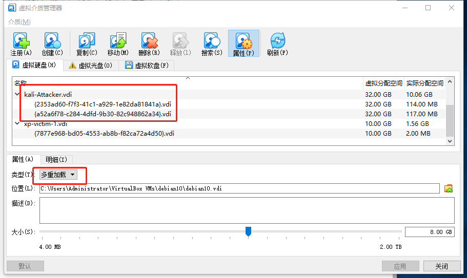

  + 检查虚拟机器kali-Attacker的设置为**硬盘启动优先**、**没有盘片**、**使用NAT网络**，检查没有问题便可以启动；

  + 新建虚拟机器`kali-victim-1`,作为配有内部网络intnet1网络的靶机，创建硬盘时使用**使用已有的虚拟硬盘文件**，选择**kali-Attacker.vdi(多重加载，32.00GB)**。

    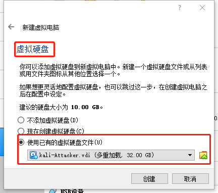

    

  + 至此，以`kali`为基础镜像的多重加载已经完成。两台虚拟电脑启动之后的效果如下图所示：

    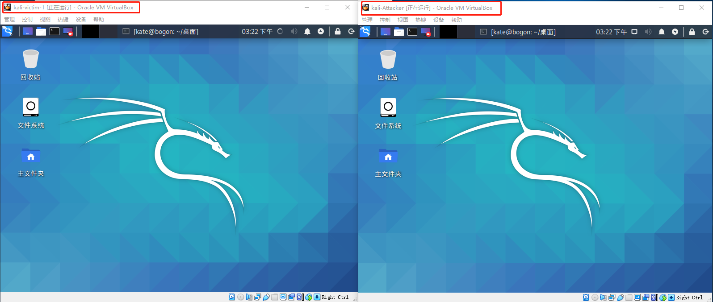

  + 对于以`xp`和`debian`为镜像的虚拟机器的多重加载的方式同上(稍有差别的是虚拟机器的安装过程和网卡的配置)。最后所有安装的虚拟机器如下：

    

    至此，完成了本次实验所需的所有虚拟机器的安装。

    接下来配置如下图所示的网络拓扑：
  
     
  
  

### 网络配置

启动网关后发现，除了本地回环地址`lo`和第一块网卡（NAT网络）对应的`enp0s3`是有ip地址的，网卡2`enp0s8`（内部网络1）和网卡3`enp0s9`（内部网络2）均无IP地址。

接下来进行一些配置使得网关成为内部网络的DHCP和DNS服务器。

+ 第一步：为网关debian的emp0s8（第二块网卡，对应着内部网络intnet1）设置静态ip

  + 具体做法是编辑 [`/etc/network/interfaces`](./interfaces.txt)，添加如下配置：

    ```shell
    auto enp0s8
    iface enp0s8 inet static
        address 192.168.1.1/24
    auto enp0s9
    iface enp0s8 inet static
        address 192.168.2.1/24    
    ```

  + 然后重启networking使得配置生效；

    ```shell
    sudo systemctl restart networking
    ```
    
    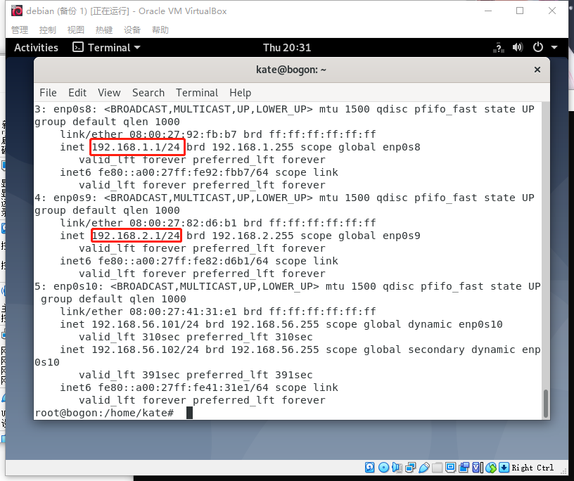

+ 第二步：安装`DHCP、DNS`服务器

  + 安装`dnsmasq`服务器

    ```shell
    # ping baidu.com 用于测试虚拟机器是否可以正常上网。
    sudo apt-get update  #更新源
    sudo apt install dnsmasq #安装
    ```
  
+ 编辑 [`/etc/dnsmasq.conf`](dnsmasq.conf)，添加如下配置：
  
  ```
    interface=enp0s8
    listen-address=192.168.1.1
    dhcp-range=192.168.1.10,192.168.1.150,255.255.255.0,12h
    dhcp-option=3,192.168.1.1
    
    interface=enp0s8
    listen-address=192.168.2.1
    dhcp-range=192.168.2.10,192.168.2.150,255.255.255.0,12h
    dhcp-option=3,192.168.2.1
  ```
  
+ 重启服务
  
  ```
    sudo systemctl restart dnsmasq
  ```
  
  + 查看服务
  
    ```shell
    apt-get install net-tools
    netstat -anp | egrep '53|67'
    #53是DNS默认监听端口；67是DHCP默认监听端口。
    ```
  
    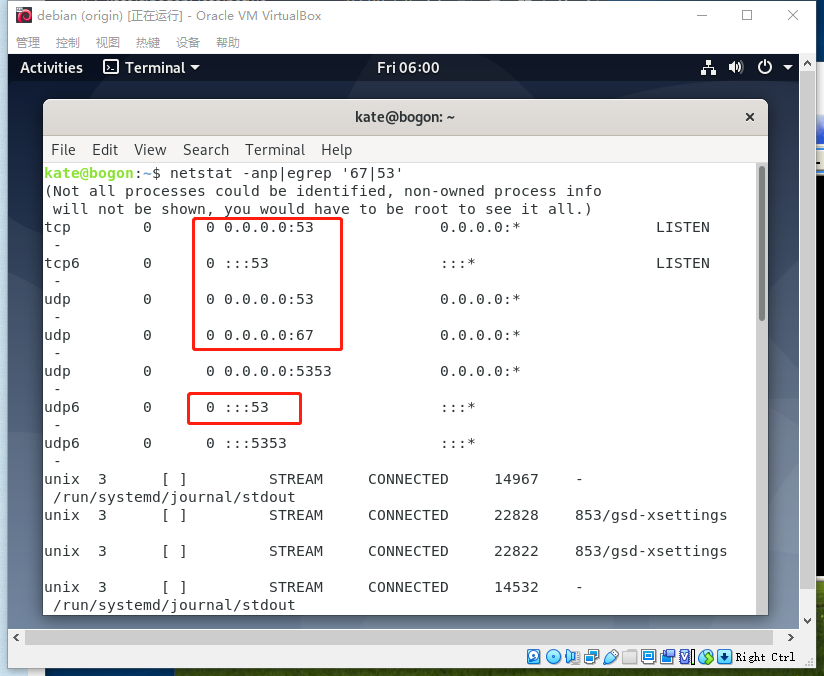

+ 第三步：对靶机进行网络配置，使其能够通过DHCP请求的方式从网关debian处动态获取IP地址。

  + `kali-victim-1`

    + 在`/etc/network/interface`中添加：

    ```
    auto eth0
    iface eth0 inet dhcp 
    ```

    + 重启networking服务。
  
+ 结果
  
  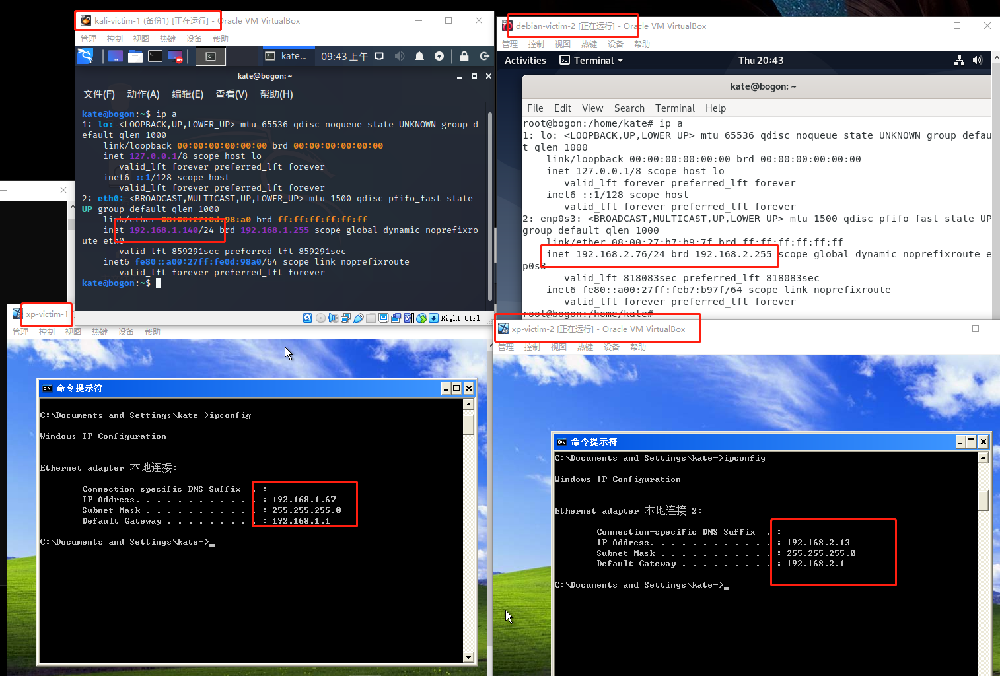
  
  
  
+ 第四步：在网关debian上配置IP转发的NAT使得网关可以转发来自局域网的数据。

  + 在`etc/network/interface`里对应的`enp0s3`添加：

    ```shell
    allow-hotplug enp0s3
    iface enp0s3 inet dhcp
          post-up iptables -t nat -A POSTROUTING -s 192.168.1.0/24 ! -d 192.168.0.0/16 -o enp0s3 -j MASQUERADE #配置内网1的数据包从enp0s3伪装转发 -s 指定的是源， -d指定的是目的地址， ! -d 是非该目的地址 -j 指定动作， MASQUERADE 是伪装 -o 指定数据流出的网卡 -A 往POSTROUTING链上添加一条规则 -t 指定是nat表
            post-up iptables -t nat -A POSTROUTING -s 192.168.2.0/24 ! -d 192.168.0.0/16 -o enp0s3 -j MASQUERADE
          post-up iptables  -A FORWARD -s 192.168.1.0/24 ! -d 192.168.0.0/16 -j ACCEPT # 从内部网络1到非192.168.0.0/16 的数据的转发接受
            post-up iptables  -A FORWARD -s 192.168.2.0/24 ! -d 192.168.0.0/16 -j ACCEPT
          post-up iptables -I INPUT -s 192.168.1.0/24 -d 192.168.2.0/24 -j DROP # 从内部网络1流入网关的数据丢弃
            post-up iptables -I INPUT -s 192.168.2.0/24 -d 192.168.1.0/24 -j DROP # 从内部网络2流入网关的数据丢弃
            post-up echo 1 > /proc/sys/net/ipv4/ip_forward 
            post-down echo 0 > /proc/sys/net/ipv4/ip_forward # 当enp0s3 down的时候，恢复原始配置
            post-down iptables -t nat -F # -F 清空 nat 表中的规则
            post-down iptables -F # 清空默认表中的规则
    ```
    
  + 然后执行`ifup enp0s3`,使配置生效。

+ 第五步：在受害者主机进行网络连通性测试，看是否可以`ping`通外网。

  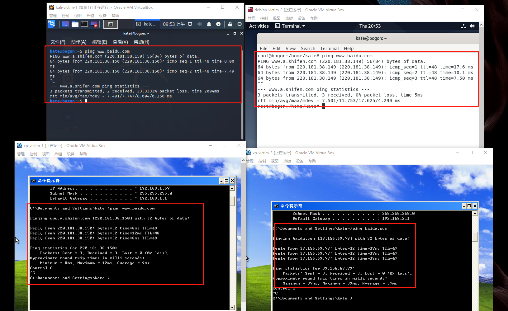

  


## 网络连通性测试

- [x] 靶机可以直接访问攻击者主机

  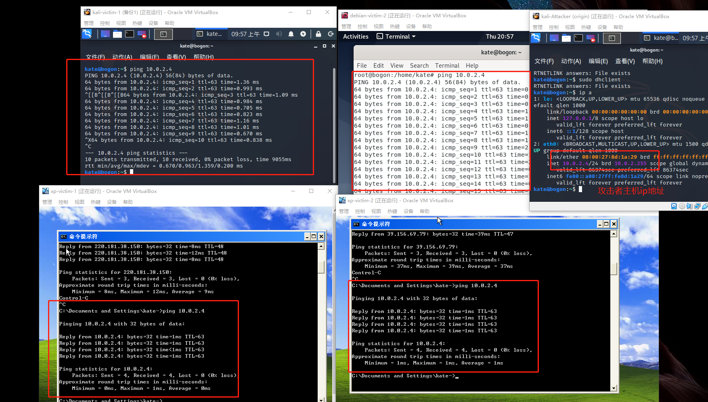

- [x] 攻击者主机无法直接访问靶机

  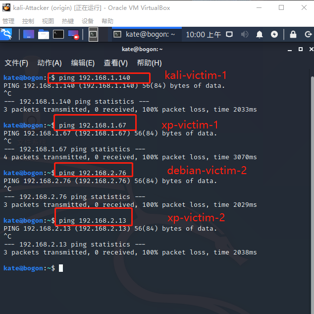

- [x] 网关可以直接访问攻击者主机和靶机

  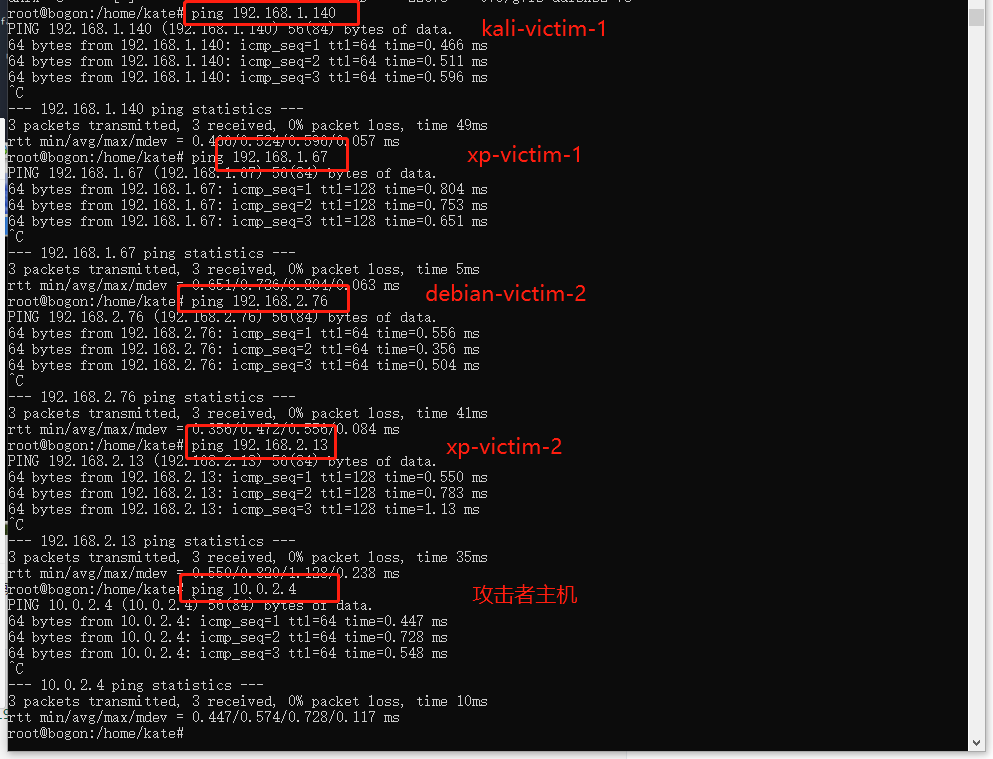

- [x] 靶机的所有对外上下行流量必须经过网关

  + 下载`tcpdump`并用其对流经enp0s3的流量进行监控，写进2020.1.0cap中

    ```
    apt insatll tcpdum
    tcpdump -i enp0s8 -n -w 2020.1.0cap 监听从enp0s8流入的数据
    ```

  + 在xp-victim-1中执行`ping bing.com`

  + 结束tcpdump命令，将[2020.1.1cap](./2020.1.1cap)通过scp拷贝到Windows中：

  ```shell
  #scp username@servername:/path/filename /var/www/local_dir（本地目录）
  C:\Users\kate>scp kate@192.168.56.101:/home/kate/2020.1.1cap ./
  
  ```

  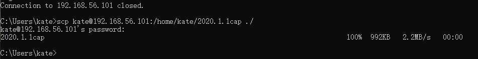

  + 用wireshark分析通过网关的流量

    + 由下图可以看出：`192.168.1.56`(xp-victim-1)与外界的通信是要经过`192.168.1.1`的。

    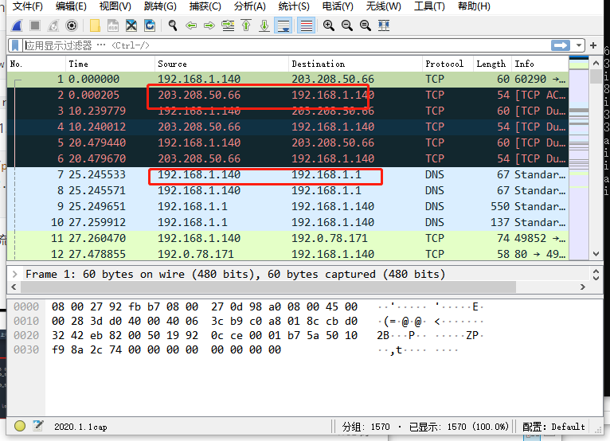

- [x] 所有节点均可以访问互联网

  


## 遇到的问题

1. 问题一（已解决）：

   1.  问题描述

   + 当时的环境：

     

   + kali-victim-1已经可以ping通网关，可以ping通外网baidu.com,证明网关的配置正确。

   + **虚拟机器xp使用ipconfig查看网络连接情况时，情况如图显示，（且目前无法ping通网关和外网），如何查看具体的网络状况？以便后续的配置**

     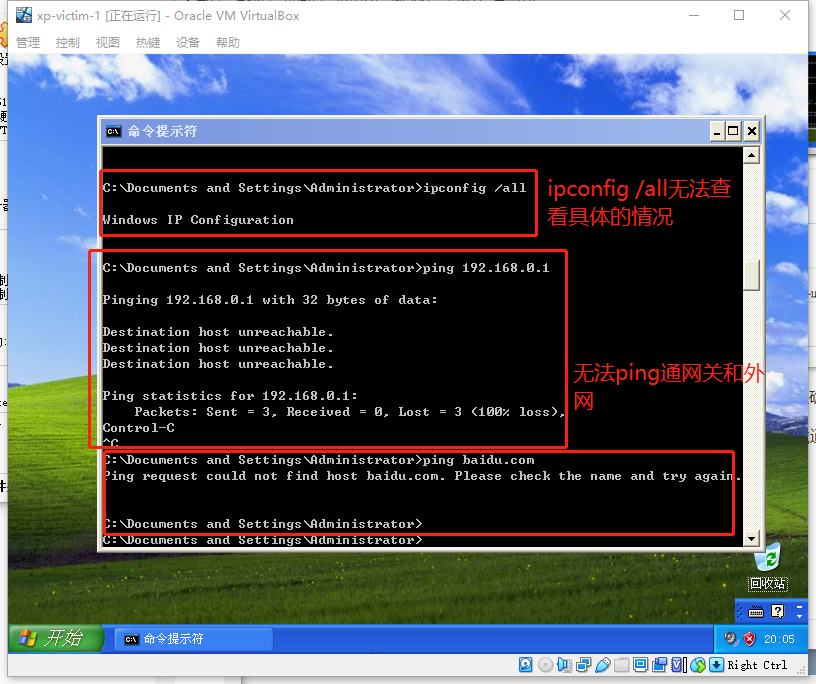

   + 注：图形界面查看的方式也尝试了，无果。

   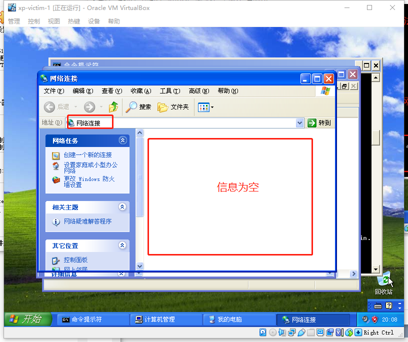

2. 原因：物理层故障==>xp不支持因特尔的1000M网卡。需要改用其他的网卡即可。

   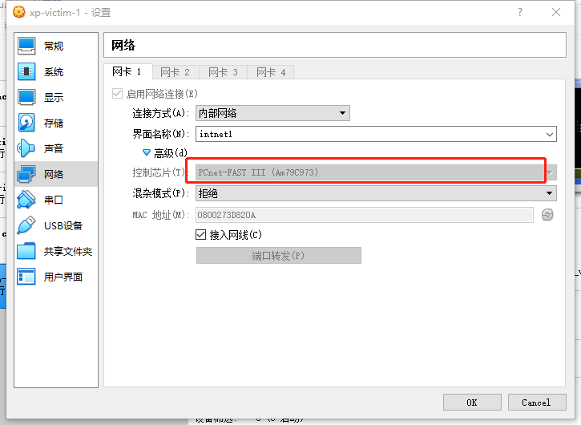

3. 结果：

   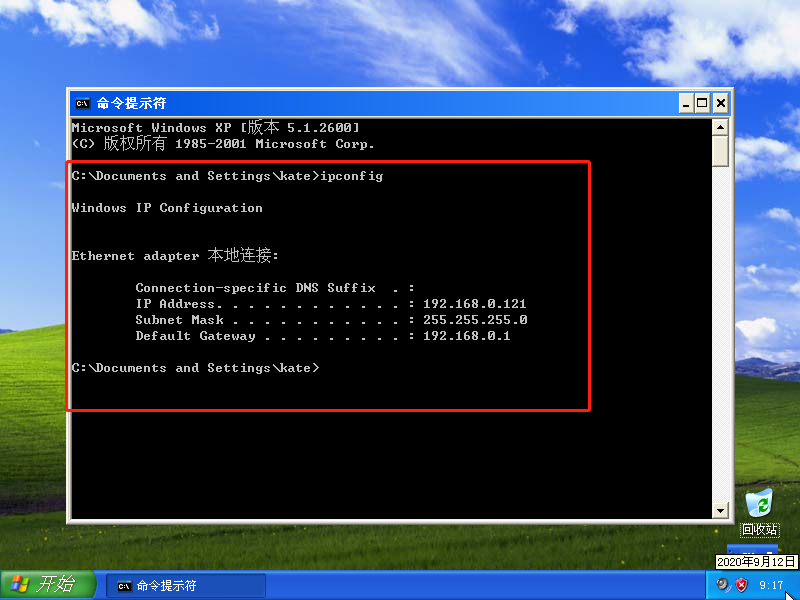

+ 问题2：同一内部网络，debian ping不通xp，xp可以ping通debian。（已解决）
  
  + xp关闭防火墙即可。
  
  ## 参考文献
  
+ [iptables详解](https://www.jianshu.com/p/ee4ee15d3658)

+ [iptables表查询、删除规则](https://www.cnblogs.com/alamps/p/8466331.html)

+ iptables逻辑框架图：


​	

