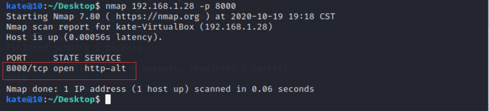
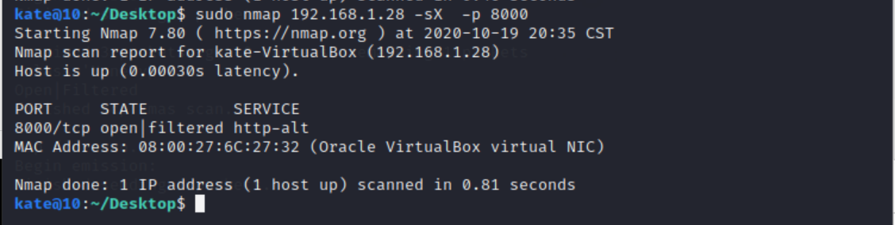

##  实验五：基于 Scapy 编写端口扫描器

### 实验目的

- 掌握网络扫描之端口状态探测的基本原理

### 实验环境

+ Virtualbox
+ kali
+ debian

- python3 + [scapy](https://scapy.net/)2.4

### 实验要求

- [x] TCP connect scan / TCP stealth scan
- [x] TCP Xmas scan / TCP fin scan / TCP null scan
- [x] UDP scan
- [x] 上述每种扫描技术的实现测试均需要测试端口状态为：`开放`、`关闭` 和 `过滤` 状态时的程序执行结果
- [x] 提供每一次扫描测试的抓包结果并分析与课本中的扫描方法原理是否相符？如果不同，试分析原因；
- [x] 在实验报告中详细说明实验网络环境拓扑、被测试 IP 的端口状态是如何模拟的
- [x] （可选）复刻 `nmap` 的上述扫描技术实现的命令行参数开关（每种扫描测试一种状态，且后面专门用nmap进行了扫描实验）

### 实验基础

```
iptables -F //清除所有iptables规则

```


### 实验过程

#### 网络拓扑

+ 网管的网卡：内部网络一、NAT转发。
  + 并在网管处配置内部网络一的dns服务器和dhcp服务器。

+ kali：内部网络一
  + 进行扫描的主机。
+ debian2：内部网络一
  + 模拟tcp、udp服务的主机，同时也是被扫描的主机。


#### 端口状态模拟

+ **关闭状态**：对应端口关闭

+ **开启状态**：对应端口开启，iptables规则为ACCEPT

  ```bash
  #TCP
  python3 -m http.server //默认8080端口
  //iptables部分规则：
  kate@kate-VirtualBox:~/桌面$ sudo iptables -nv -L INPUT
  Chain INPUT (policy DROP 0 packets, 0 bytes)
   pkts bytes target     prot opt in     out     source               destination         
      4   344 ufw-after-logging-input  all  --  *      *       0.0.0.0/0            0.0.0.0/0           
      4   344 ufw-reject-input  all  --  *      *       0.0.0.0/0            0.0.0.0/0           
      4   344 ufw-track-input  all  --  *      *       0.0.0.0/0            0.0.0.0/0           
  kate@kate-VirtualBox:~/桌面$ 
  
  #UDP
  nc -l -u -p 8000 //开启udp端口
  netstat -antup | grep 8000 //查看8000端口是否启动了UDP监听
  
  nc - vuz 192.168.1.28 80000 //在客户端检测
  //dnsmasq 53端口为UDP
  systemctl dnsmasq restart
  ```

+ **过滤状态**：对应状态开启，iptables 规则为DROP

  ```bash
  #过滤规则
  sudo iptables -I INPUT  -j DROP -p 端口号//过滤所有的tcp的数据包
  
  kate@kate-VirtualBox:~/桌面$ sudo iptables -nv -L INPUT
  Chain INPUT (policy DROP 0 packets, 0 bytes)
   pkts bytes target     prot opt in     out     source               destination         
      0     0            tcp  --  DEROP  *       0.0.0.0/0            0.0.0.0/0           
      2   172 ufw-after-logging-input  all  --  *      *       0.0.0.0/0            0.0.0.0/0           
      2   172 ufw-reject-input  all  --  *      *       0.0.0.0/0            0.0.0.0/0           
      2   172 ufw-track-input  all  --  *      *       0.0.0.0/0            0.0.0.0/0           
  kate@kate-VirtualBox:~/桌面$ 
  ```

#### TCP connect扫描

+ **OPEN**

  

  

  

+ **CLOSE**

  

  

  

+ **FILTER**

  ```
  #过滤规则
  iptables -I INPUT -p tcp -i DEROP//过滤所有的tcp的数据包
  ```

  

  

  

  

#### TCP syn扫描

+ **OPEN**

  

  

  

+ **CLOSE**

  

  

  

+ **FILTER**

  ```
  #过滤规则
  iptables -I INPUT -p tcp -i DEROP//过滤所有的tcp的数据包
  ```

  

  

  

#### TCP Xmas扫描

**OPEN**




**CLOSE**


**FILTERED**


#### TCP fin扫描

注：TCP fin 的OPEN和FILTERED的扫描是扫描网关来模拟的（网关ip：192.168.1.1）

**OPEN**


**CLOSE**


**FILTERED**


#### TCP null扫描

**OPEN**


**CLOSE**


**FILTERED**


#### UDP扫描

**OPEN**


**CLOSE**


**FILTERED**


#### 其他实验问题的回答

> 提供每一次扫描测试的抓包结果并分析与课本中的扫描方法原理是否相符？如果不同，试分析原因；

相同。

### 参考

[黄大课件](https://github.com/c4pr1c3/cuc-ns-ppt/blob/master/chap0x05.md)

[2020-ns-public-LyuLumos](https://github.com/CUCCS/2020-ns-public-LyuLumos)