# 实验九 入侵检测

##  实验环境

+ VirtualBox
+ debian 10.0.2.5 enp0s3 Nat网络
+ ubuntu 10.0.2.15 enp0s3 Nat网络
+ snort

## 实验过程

### 安装

```bash
# 禁止在apt安装时弹出交互式配置界面
export DEBIAN_FRONTEND=noninteractive

apt install snort
```

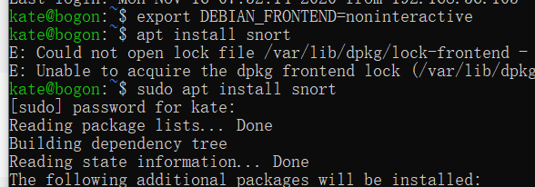

### 实验一：配置snort为嗅探模式

```bash
# 显示IP/TCP/UDP/ICMP头
snort –v

# 显示应用层数据
snort -vd

# 显示数据链路层报文头
snort -vde

# -b 参数表示报文存储格式为 tcpdump 格式文件
# -q 静默操作，不显示版本欢迎信息和初始化信息
snort -q -v -b -i enp0s3 "port not 22"

# 使用 CTRL-C 退出嗅探模式
# 嗅探到的数据包会保存在 /var/log/snort/snort.log.<epoch timestamp>
# 其中<epoch timestamp>为抓包开始时间的UNIX Epoch Time格式串
# 可以通过命令 date -d @<epoch timestamp> 转换时间为人类可读格式
# exampel: date -d @1511870195 转换时间为人类可读格式
# 上述命令用tshark等价实现如下：
tshark -i eth1 -f "port not 22" -w 1_tshark.pcap
```

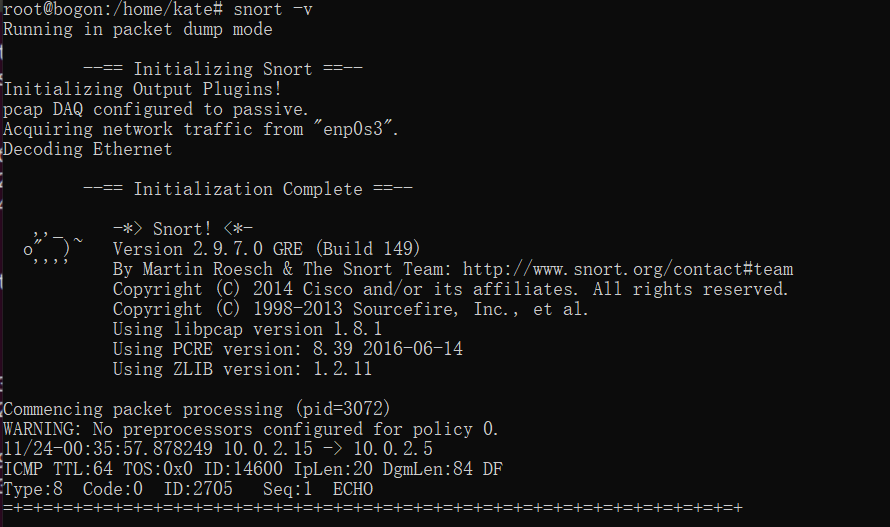

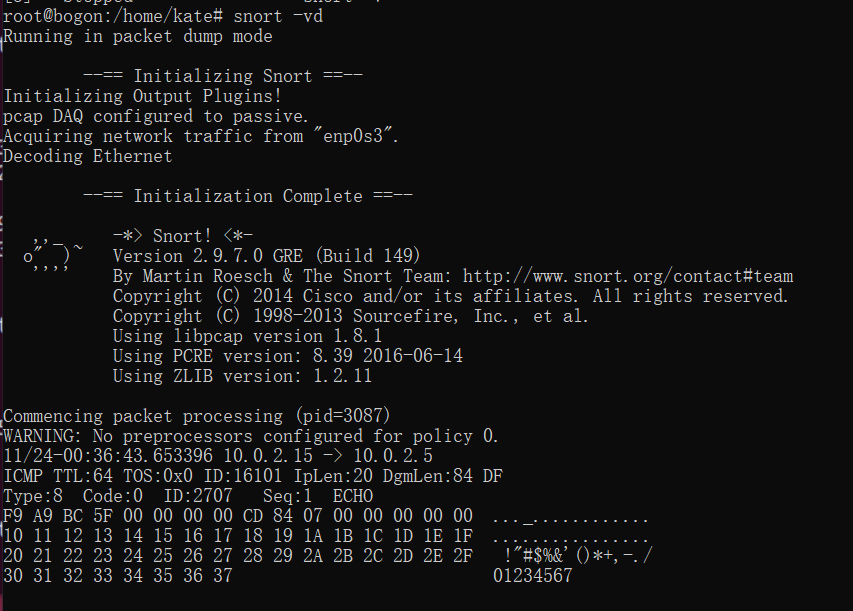

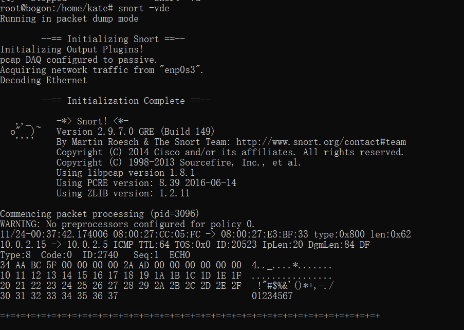


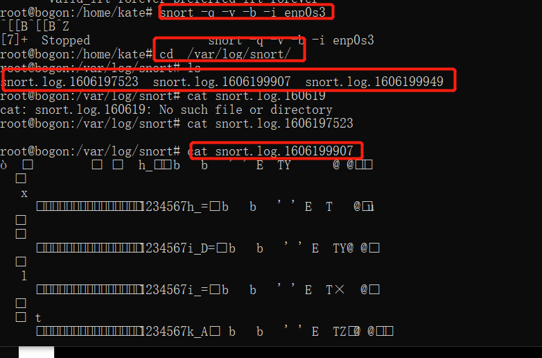

### 实验二：配置并启用snort内置规则

```bash
# /etc/snort/snort.conf 中的 HOME_NET 和 EXTERNAL_NET 需要正确定义
# 例如，学习实验目的，可以将上述两个变量值均设置为 any
snort -q -A console -b -i enp0s3 -c /etc/snort/snort.conf -l /var/log/snort/
```

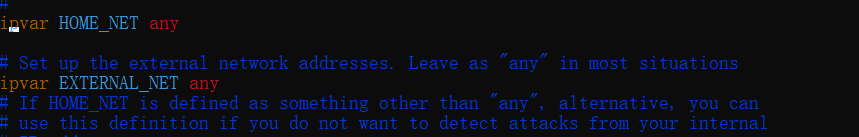

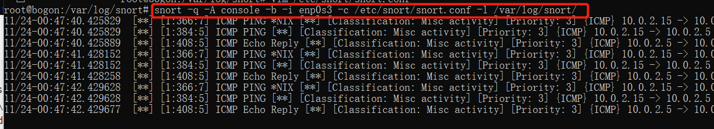

### 实验三：自定义snort规则

```bash
# 新建自定义 snort 规则文件
cat << EOF > /etc/snort/rules/cnss.rules
alert tcp \$EXTERNAL_NET any -> \$HTTP_SERVERS 80 (msg:"Access Violation has been detected on /etc/passwd ";flags: A+; content:"/etc/passwd"; nocase;sid:1000001; rev:1;)
alert tcp \$EXTERNAL_NET any -> \$HTTP_SERVERS 80 (msg:"Possible too many connections toward my http server"; threshold:type threshold, track by_src, count 100, seconds 2; classtype:attempted-dos; sid:1000002; rev:1;)
EOF
# 添加配置代码到 /etc/snort/snort.conf
include $RULE_PATH/cnss.rules
snort -q -A fast -b -i enp0s3 -c /etc/snort/snort.conf -l /var/log/snort/
```

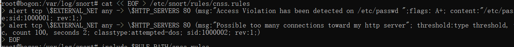

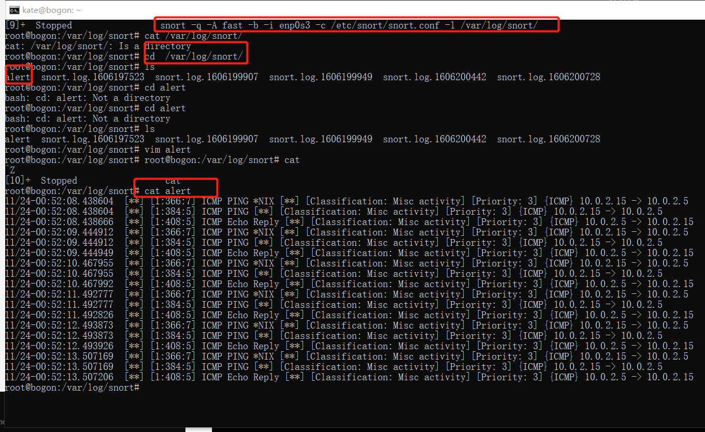

### 实验四：和防火墙联动

本实验需要用到的脚本代码 [Guardian-1.7.tar.gz](https://c4pr1c3.github.io/cuc-ns/chap0x09/attach/guardian.tar.gz) ，请下载后解压缩：

```bash
# 解压缩 Guardian-1.7.tar.gz
tar zxf guardian.tar.gz

# 安装 Guardian 的依赖 lib
apt install libperl4-corelibs-perl
```

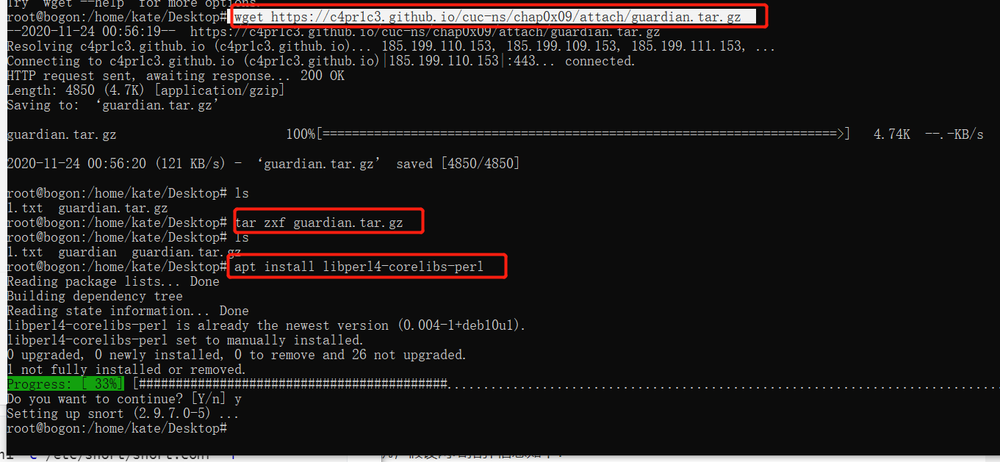

本次实验需要的一个最小化的实验环境是2台主机，网络拓扑信息如下：

+ VM-1 IP: 10.0.2.5 enp0s3 Nat网络 运行 `snort` 和 `guardian.pl`
+ VM-2 IP: 10.0.2.15 enp0s3 Nat网络  运行 `nmap` 

开始实验之前，VM-1 和 VM-2 可以互相双向访问。

在VM-2上先后开启 `snort` 和 `guardian.pl`

```bash
# 开启 snort
snort -q -A fast -b -i eth1 -c /etc/snort/snort.conf -l /var/log/snort/
# 假设 guardian.tar.gz 解压缩后文件均在 /root/guardian 下
cd /root/guardian
```

编辑 guardian.conf 并保存，确认以下2个参数的配置符合主机的实际环境参数。

```ini
HostIpAddr      10.0.2.5
Interface       enp0s3 
# 启动 guardian.pl
perl guardian.pl -c guardian.conf
```

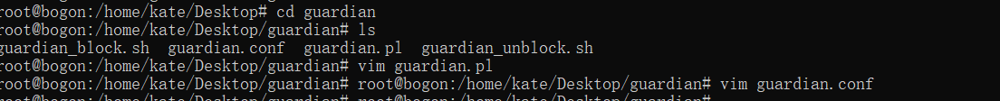

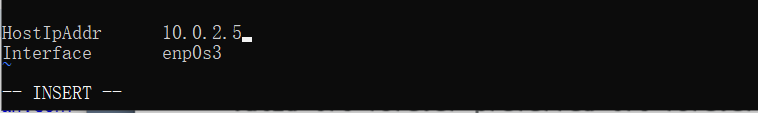

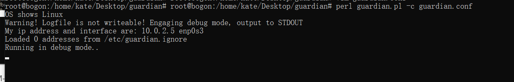

在VM-2上用 `nmap` 暴力扫描 VM-1：

```bash
nmap 10.0.2.5 -A -T4 -n -vv
```

guardian.conf 中默认的来源IP被屏蔽时间是 60 秒（屏蔽期间如果黑名单上的来源IP再次触发snort报警消息，则屏蔽时间会继续累加60秒）

```bash
root@KaliRolling:~/guardian# iptables -L -n
Chain INPUT (policy ACCEPT)
target     prot opt source               destination
REJECT     tcp  --  192.168.56.101       0.0.0.0/0            reject-with tcp-reset
DROP       all  --  192.168.56.101       0.0.0.0/0

Chain FORWARD (policy ACCEPT)
target     prot opt source               destination

Chain OUTPUT (policy ACCEPT)
target     prot opt source               destination

# 1分钟后，guardian.pl 会删除刚才添加的2条 iptables 规则
root@KaliRolling:~/guardian# iptables -L -n
Chain INPUT (policy ACCEPT)
target     prot opt source               destination

Chain FORWARD (policy ACCEPT)
target     prot opt source               destination

Chain OUTPUT (policy ACCEPT)
target     prot opt source               destination
```

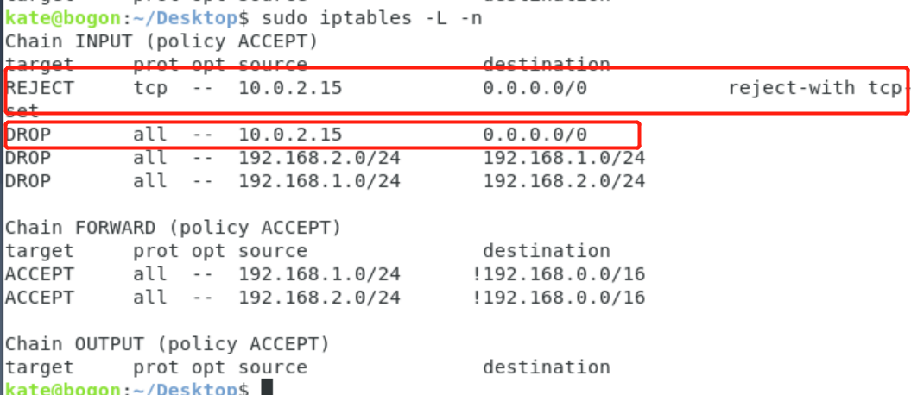


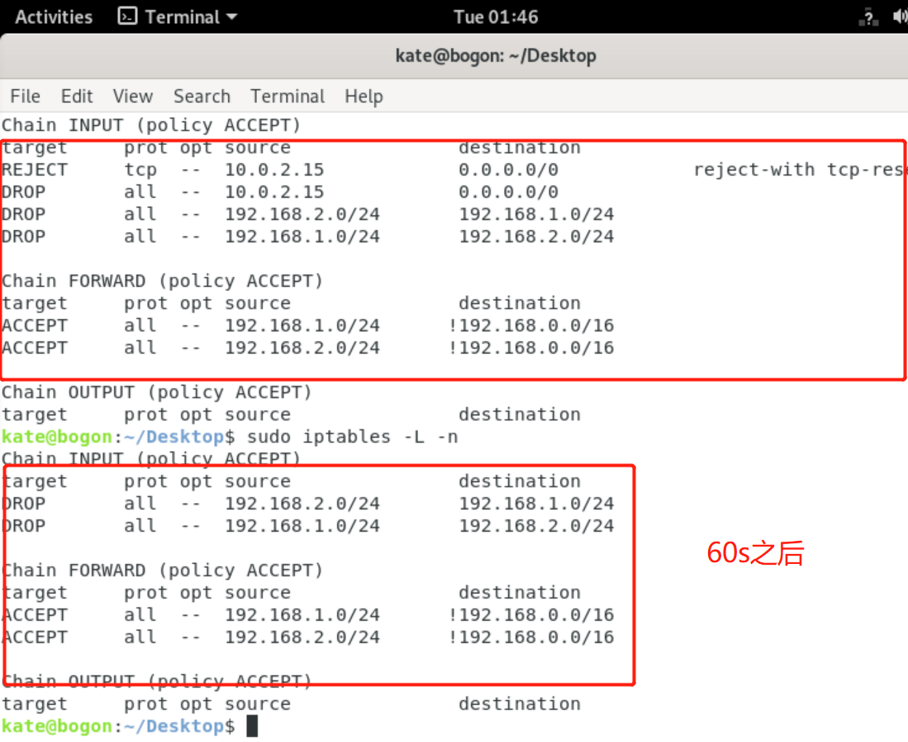

## 参考

[2020-ns-public-LyuLumos](https://github.com/CUCCS/2020-ns-public-LyuLumos/tree/ch0x09)