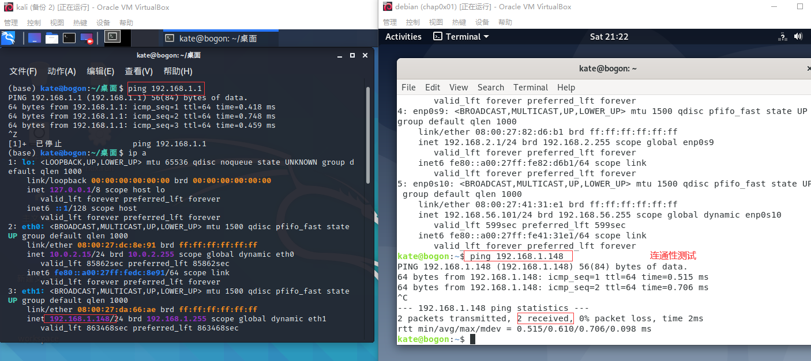
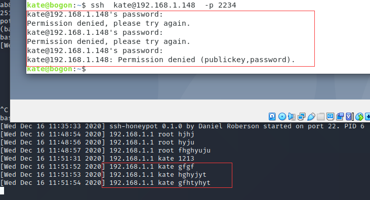
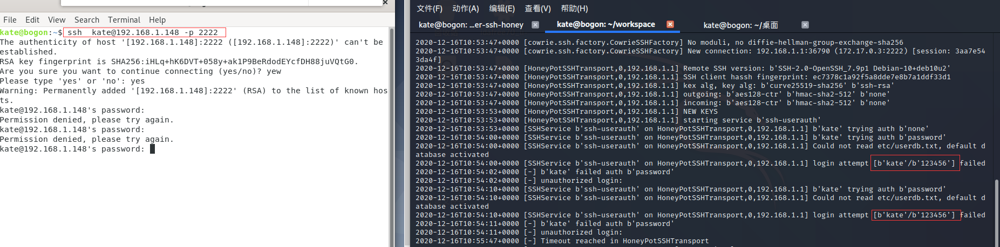

---

---

# 第十一章 常见蜜罐体验和探索

##  实验目的

- 了解蜜罐的分类和基本原理
- 了解不同类型蜜罐的适用场合
- 掌握常见蜜罐的搭建和使用

## 实验环境

- 从paralax/awesome-honeypots中选择 1 种低交互蜜罐和 1 种中等交互蜜罐进行搭建实验
  - 推荐 `SSH` 蜜罐

## 实验要求

+ [x] 记录蜜罐的详细搭建过程；
+ [x] 使用 `nmap` 扫描搭建好的蜜罐并分析扫描结果，同时分析「 `nmap` 扫描期间」蜜罐上记录得到的信息；
+ [x] 如何辨别当前目标是一个「蜜罐」？以自己搭建的蜜罐为例进行说明；
+ [x] （可选）总结常见的蜜罐识别和检测方法；
+ [ ] （可选）基于 [canarytokens](https://github.com/thinkst/canarytokens) 搭建蜜信实验环境进行自由探索型实验；

## 试验过程

### 环境搭建

#### 网络拓扑图


其中，后续试验中，在kali中搭建蜜罐，并且将网关debian作为Attacker，模拟攻击者攻击的过程。

#### 网络连通性测试

###  低交互蜜罐ssh-Honeypot

#### 选型依据

+ 低交互性。
+ docker搭建，简介快速。

#### 蜜罐搭建过程

+ 验证docker

  

  

+ 克隆仓库，构建并运行镜像，进入容器查看日志。

  ```
  git clone https://github.com/random-robbie/docker-ssh-honey
  cd docker-ssh-honey
  docker build . -t local:ssh-honeypot # 构建镜像
  docker run -p 2234:22 local:ssh-honeypot # 运行镜像，并将容器的22端口与本地的2234端口一一对应起来
  docker exec -i -t id bash # 进入容器并执行bash
  tail -F ssh-honeypot.log  # 查看ssh-honeypot.log日志文件
  ```

  

  

  

#### 蜜罐测试

+ 以普通用户`kate`为身份进行`ssh`连接，连接被拒绝。

  

+ 以`root`为身份进行`ssh`连接，连接同样被拒绝。因为这是一个低交互的蜜罐，拒绝一切连接。

  

+ `namp`扫描，并没有扫描到蜜罐的信息，也就是说，蜜罐并没有对`nmap`扫描数据包做出响应，再次说明了该蜜罐的低交户性。同时，蜜罐也没有记录任何`namp`扫描的信息。

  

  

### Cowrie

#### 选型依据

+ 中交互。
+ docker搭建，简介快速。

#### 蜜罐搭建过程

+ docker安装镜像

  ```
  docker pull cowrie/cowrie
  ```

+ 创建一个新的容器

  ```
  docker run -p 2222:2222 cowrie/cowrie
  ```

  

#### 蜜罐测试

+ 使用普通用户kate进行ssh连接,连接失败，且连接行为以及所尝试密码被记录。

  

+ 使用root用户进行ssh远程连接。发现使用123456等弱密码无法登录成功，但是11111和ASWDEE、test等其他字符串可以获取shell权限。

  

#### 判别蜜罐

+ `ping`、`wget`命令存在。

  

+ 常见命令找不到，例如：`apt`、`vim`等。

  

+ 使用`apt-get`下载`vim`的时候，重复下载具有相同的现象,而不是报告已下载。

  

+ `nmap`扫描主机2222端口，发现端口开放，且服务是一个`EtherNetIP-1`，可能是一个蜜罐。

  

### 判断是否为一个蜜罐？

+ 常见命令是否存在？

  若`vim`,`ping`,`apt`等常用命令不存在，则可以怀疑所侵入的是不是一个蜜罐。

+ 对重复下载等重复性的操作是否多次表现出一样的现象，即现象并没有根据已执行的一些命令和操作而变化，而是有点像事先写好的一个假反馈的结果。

+ 不对诸如`nmap`扫描，`ping`等做出回应的系统。

## 参考资料

[2020-ns-public-ZXMMD/blob/chap0x11/chap0x11/chap0x11.md](https://github.com/CUCCS/2020-ns-public-ZXMMD/blob/chap0x11/chap0x11/chap0x11.md)

